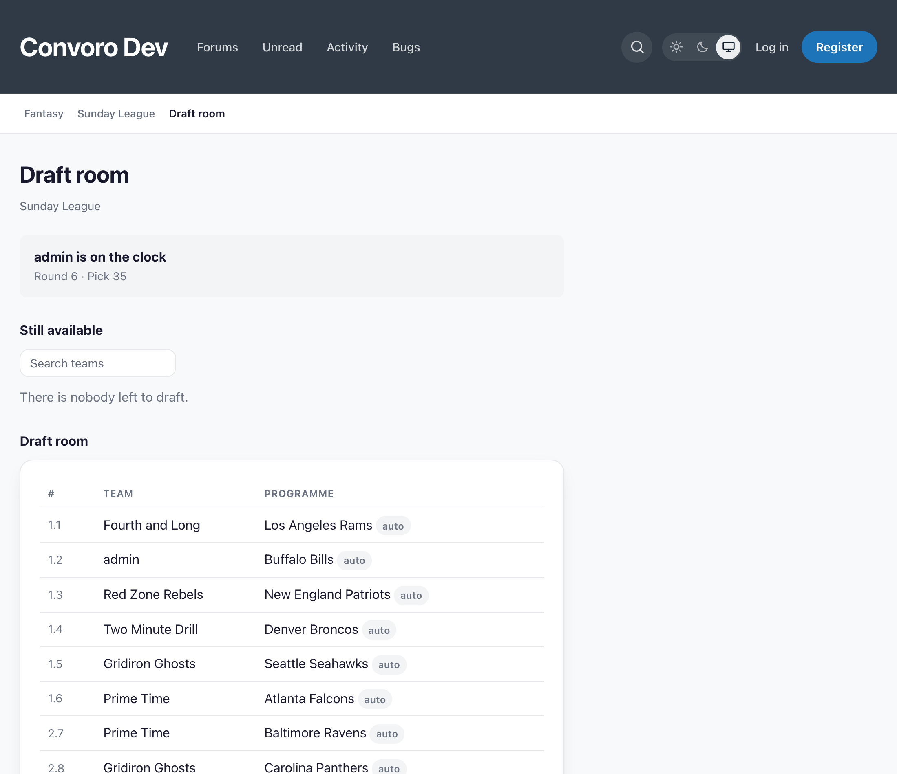
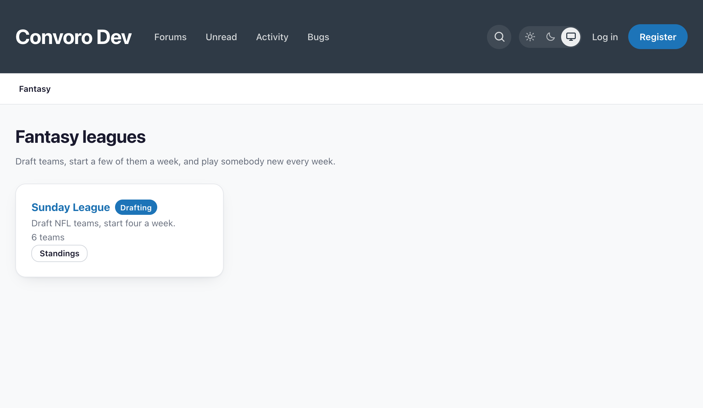

# Fantasy

A season-long fantasy league for [Convoro](https://convoro.co), where members
draft **teams** rather than players.

Snake draft, weekly lineups that lock at each team's own kickoff, head-to-head
matchups against another franchise every week, and a scoring system the
commissioner sets. Every result is read from the fixtures and scores
[Picks](https://github.com/ernestdefoe/convoro-fbsfb-picks) already syncs, so nothing
here needs a second data source or a second API key.

A draft room, mid-draft — and only teams that actually play in the league's
season are in it:

Leagues live at `/fantasy`:

Third-party extension by Ernest Defoe. Requires Convoro **^1.3.10** and Picks.

## More than one sport

A fantasy league plays a **Picks season**, and a season now belongs to a
competition — so a league plays whatever that competition is: college football,
the NFL, the NBA, MLB, the NHL, MLS or the Premier League.

Two things follow from that, and both are the whole of the multi-sport work:

**A draft only offers teams that actually play in the season.** `picks_teams`
held one sport's teams when this was written and now holds six, so "a team
exists" stopped being the same question as "a team is in this competition".
Without the scope, a college-football draft board offers the Milwaukee Bucks —
and a franchise that took one is a starter short for the rest of the year with
nothing on screen saying why. It is asked of the **fixtures** rather than of a
label, which is stricter: a club with no games this season is not draftable
however it is filed.

**A league starts from its own sport's numbers.** The rules are the same
everywhere — points scored, points allowed, margin of victory, a win, a shutout,
an upset. The numbers are not:

| Sport | A game | Per point | Win | Shutout |
|---|---|---|---|---|
| Gridiron | ~31–17 | 1.00 | 10 | 8 |
| Basketball | ~112–104 | 0.25 | 10 | — |
| Baseball | ~5–3 | 4.00 | 10 | 12 |
| Ice hockey | ~3–2 | 6.00 | 10 | 15 |
| Football | ~2–1 | 12.00 | 15 | 10 |

They are calibrated so an ordinary win is worth roughly the same in any sport —
between 25 and 39 points for one starter — which is what makes two leagues on
one forum comparable and stops a basketball table reading like a phone number.

🚨 **A basketball shutout bonus is zero, not inherited**, because a basketball
shutout cannot happen. A rule that can never pay out reads as a broken rule
rather than as an impossible event, and the franchise page hides it for the same
reason it already hides an upset bonus of zero.

🚨 **The win bonus carries proportionally more in football than anywhere else**,
and that is deliberate. In a sport where a one-goal win is the ordinary result,
the *result* is most of what happened — a rate-heavy scheme would make a 3–2
defeat outscore a 1–0 win, which is not how anybody watches it.

Everything stays editable. A commissioner who wants gridiron's rates in a
basketball league can have them; this only decides what a new league starts
from, and it never touches a league that already exists.

## Licence

MIT.
